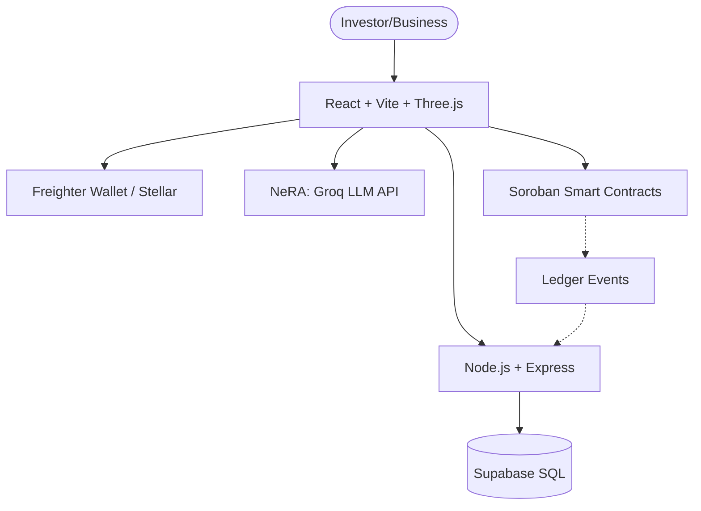

# 🏛️ NestFund Architecture Diagram

NestFund is a full-stack decentralized application (dApp) built on the Stellar network using Soroban smart contracts, designed for fractionalized asset investment.

## 🌉 High-Level Overview

## 🏗️ Core Components

### 1. Frontend (React / Vite)
- **3D Visualization**: Using Three.js / React Three Fiber for immersive investor dashboards.
- **Wallet Integration**: `@stellar/freighter-api` for secure transaction signing.
- **Real-time UI**: Dynamic state updates for investment tracking and portfolio growth.

### 2. Backend (Express / Node.js)
- **API Gateway**: Handles metadata, verification, and non-chain data.
- **Relational Storage**: PostgreSQL via Supabase maintains listing details, user profiles, and audit history.
- **Middleware**: Validation layers for business proposal submissions.

### 3. Blockchain Layer (Soroban / Stellar)
- **Smart Contracts**: Rust-based Soroban contracts manage asset fractionalization, escrow, and automated dividend distribution.
- **Stellar Horizon**: Interface for querying ledger state and submitting transactions.

### 4. AI Layer (NeRA - NestFund Real-time Advisor)
- **Engine**: Groq Llama 3.3 70B.
- **Functions**: Risk analysis, portfolio optimization advice, and educational tutoring for new investors.

## 🔄 Data Flow: Listing a Business
1. **Business** submits details via "Business Mode".
2. **NeRA AI** performs an instant risk audit.
3. **Backend** stores listing metadata in Supabase.
4. **Smart Contract** is prepared for fractionalized token issuance.
5. **Investor** discovers the listing in "Invest Mode".
